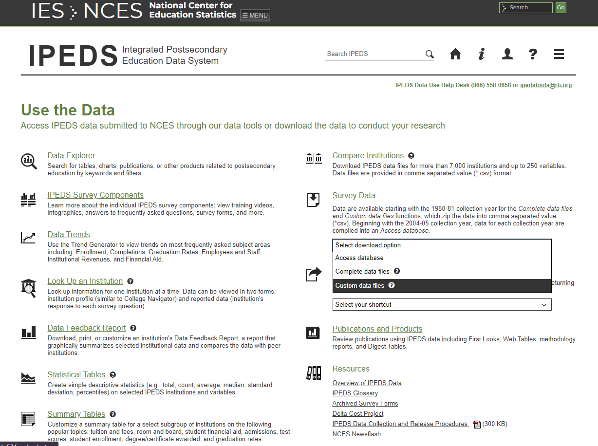
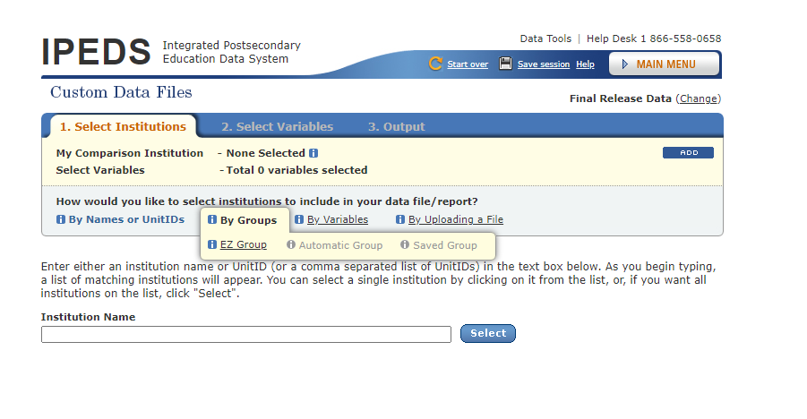
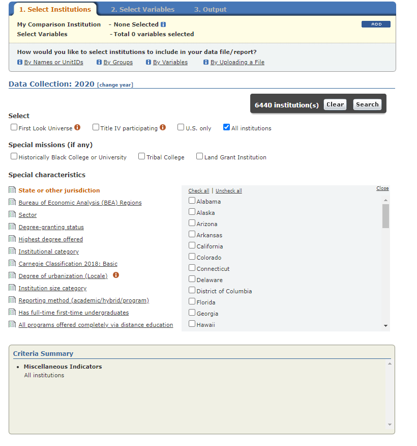
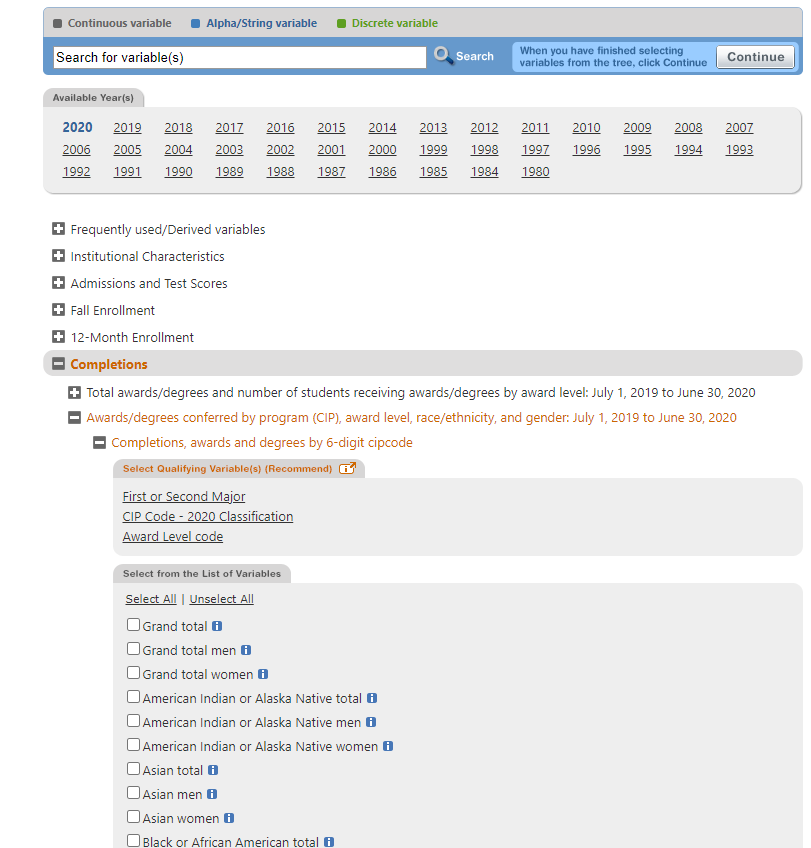
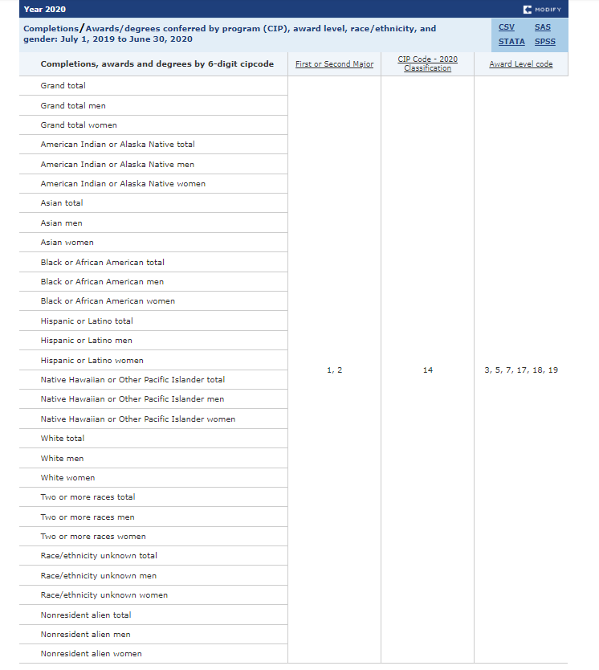

```{r setup, include=FALSE}
knitr::opts_chunk$set(echo = TRUE)
library(readr)
library(tidyverse)
library(janitor) # clean names function
completions2020raw <- read_csv("2020 US Completions raw.csv")
completions2019raw <- read_csv("2019 US Completions raw.csv")

source("Data work/processing scripts.R")
```

# Introduction
The following document will walk through the process of collecting data from IPEDS for our regional landscape report. The first iteration has focused on the states in New England with LSAMP-affiliated institutions (MA,CT, and RI). It is our hope that this template can easily be adjusted to generate reports for other regions as needed. An accompanying folder containing R scripts & functions used for data processing can be found in the same directory, many of which will be demonstrated here with more in-depth explanations of our approach. 

# IPEDS Data Collection
So far, our work has largely centered on metrics regarding student enrollment (provided biannually) and completions (provided on a yearly basis). Navigation is fairly simple. Start by navigating to: https://nces.ed.gov/ipeds/use-the-data 

> Survey data > Custom data files


To select what group of institutions we are interested in, we use EZ groups.


If interested in all schools, there is a selection option labeled "All Institutions". We can also select institutions within specific states or jurisdictions for regional analysis.


Once groups are selected, click on the tab at the top of the page labeled `2. Select Variables`.
Below is an example of the path to collecting completion data. 


Typically for this application, we are unconcerned with the difference between first and second majors. Select both options for this category. The CIP code classification we are primarily interested in is 14: Engineering. We can also use 99 to select all graduates. If interested in a further breakdown of engineering majors by field (for completion data only) we can find the more specific CIP codes nested within the drop-down menu for 14. Award level codes correspond to the different degree types one can attain. Finally, you can select the specific populations for each of the two gender options and the various race/ethnicity categories as well. Grand totals for race/ethnicity and gender do not necessarily need to be included but are typically easier to leave in the data rather than manually selecting all options. 

## Session Job Numbers
If there is a specific subset of raw data that you would like to frequently reference, IPEDS offers the option to use a "Job Number" to refer back. These are generated by clicking on the "save session" button at the top of the screen. 

A collection of particularly useful job numbers with their descriptions can be found below:

-

- 

# Raw Data Format

Below is a sample of the data in its raw form. Users can download data for each individual year, which will typically need to be joined for longitudinal analysis. 

The data set will reflect the output given from this particular IPEDS selection:


```{r}
head(completions2020raw)
```
The format of this data is a bit unwieldy. Observe that the race/ethnicity & gender data are spread in a wide format. For ease of analysis it is best to gather all of these columns. 

# Processing

## Gathering columns & cleaning variable names

There are a few functions that have been created to assist with gathering columns. The scripts are available in the R script `processing scripts.R` found in the Data work folder. process_completions() is a function that has been created to quickly process each raw csv into a tidy format. This makes joining each year's worth of data relatively easy. Below you will see two year's worth of completion data being processed and then joined together. Enrollment data is handled in the same way, just use the function process_enrollment() instead.

```{r, message = FALSE}
processed2020comp <- process_completions(completions2020raw)
processed2019comp <- process_completions(completions2019raw)

processed_combined <- rbind(processed2020comp, processed2019comp)
```

## Restructured data
```{r}
head(processed_combined)
```

## Optional: Comparisons and Proportions
This section will describe data processing that has been carried out in support of our Tableau dashboard, which provides users the option to investigate the performance of individual schools in attaining equal representation within their engineering programs(compared at both the school and regional level).

### State data
The following data-frame contains the state for each institution within the U.S. The information contained within this dataset will be used to aid in specifying the particular region of interest for this analysis. 
```{r}
states <- read_csv("State abbreviations.csv")
head(states)
```
First, you will need to create a list of all of the states within the region. For example, here is a list of the three states within the Northeast that INCLUDES will focus on.
```{r}
NE <- c("Massachusetts", "Connecticut", "Rhode Island")
```

To use the functions that have been prepared for processing, you will need a dataframe in the format generated by the processing functions above, containing data for all students (CIP code = 99) and engineering students specifically (CIP code = 14).


